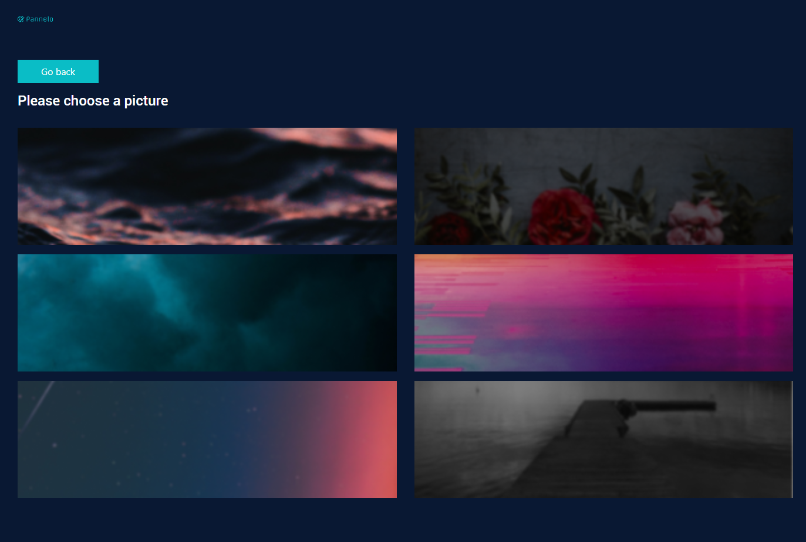
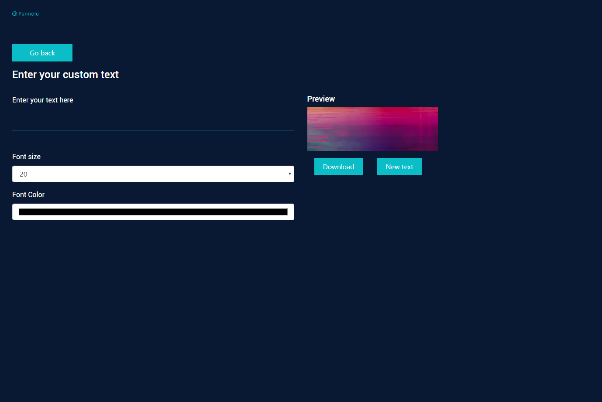

# Pannelo

## Project Description:

Pannelo is a React based web app, that allow you to create some twitch buttons with predefiened background, and custom text, font-size, and color

## Techologies:

#### Languages

- HTML
- CSS
- JS

#### Libraries

- Bootstrap
- React JS
- dom-to-image
- Save as

## Demo

You can use pannelo here: [Pannelo](https://atndesign.github.io/Pannelo/) .

## Contribution:

if you want to contribute, add your own panel bg, feel free to make a pull request, the size of a panel should be: 300 (width) x 100 (height).

## Screenshots

